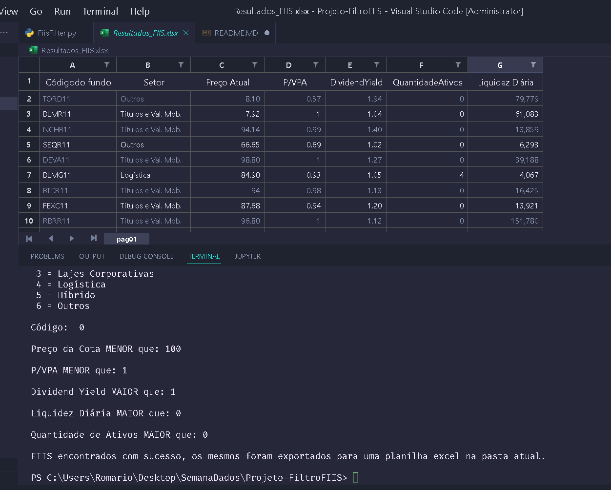

# FIIs Filter

<b> Script que permite filtrar Fundos Imobiliários listados na B3 de acordo com parâmetros informados pelo usuário.</b>

Tabela de conteúdos
=================
<!--ts-->
   * [Sobre](#Sobre)
      * [Descrição](#Descrição)
      * [Problemática](#Problemática)
      * [Objetivo](#Objetivo)
      * [Base De Dados](#Base-De-Dados)
      * [Tecnologias](#Técnologias-Usadas)
   * [Como usar](#Como-Usar)
      * [Pré-Requisitos](#Pré-Requisitos)
      * [Execução](#Executar)
   * [Resultado](#Resultado)
  
<!--te-->

# Sobre: 

## Descrição:
<b> O script possui um sistema de Web Scraping (Raspagem de Dados) que roda automaticamente quando o projeto é executado,
tal processo é responsavel por acessar determinado site e coletar determinadas informações para utilizá-las como uma base
de dados. Após a criação da base dados, o usuário poderá informar seus parâmetros por meio do terminal (Setor do Fundo, Valor
da Cota, P/VPA, Dividend Yield, Variação Diária e Quantidade de Ativos), com base nos inputs o script buscará um fundo que 
possua as características informadas, caso sejam encontrados, os mesmos serão exportados para uma planilha excel na pasta raiz
do projeto e aparecerá uma mensagem de sucesso no terminal, caso nenhum fundo atenda as características, será imprimido uma mensagem
no terminal informando que nenhum fundo foi encontrado.

## Problemática:
Atualmente cerca de 414 Fundos Imobiliários estão listados na B3 (Bolsa de Valores Brasileira), com tal quantidade, torna-se inviavel
analisar cada um deles, então a grande maioria dos investidores optam por fazer uma filtração prèvia para que depois possam se apronfudar em determinados
fundos.

## Objetivo:
O projeto tem como objetivo facilitar o processo prévio de filtragem de fundos imobiliários, no qual por meio de Inputs (Entradas) o usuário poderá informar
os requisitos para os fundos que procura, e com base nesses requisitos o próprio script retornará os fundos encontrados em uma tabela, com algumas informações
técnicas sobre os mesmos.

## Base de Dados:
Tendo em vista que fundos imobiliários são ativos de renda variável, o script possui um sistema de Web Scraping que coleta os dados do site Funds Explorer 
(https://www.fundsexplorer.com.br/funds) sempre que é executado, dessa forma, os dados utilizados no projeto sempre serão os mais atualizados.

## Técnologias Usadas: 
  * Python
  * Bibliotecas: 
    * Pandas
    * Requests
  * Ide VsCode
 

# Como Usar:

## Pré-Requisitos:
* Python 3.x
* Pandas
* Requests

## Clone o repositório para sua máquina:
* $ git clone https://github.com/RomarioHenrique/FIIsFilter

## Altere a variável HEADER informando o User-Agent do seu navegador:
* Para encontrar seu User-Agent pesquise 'My User Agent' em seu navegador.

## Executar:
* Vá para a pasta raiz do projeto no terminal ou abra ela em sua IDE.
* Na pasta raiz digite <i>python FiisFilter.py</i>
* Informe as características nos inputs (Setor, P/VPA, Dividend Yield e etc).
  * Se algum fundo for encontrado, eles serão exportados para uma planilha excel na pasta raiz do projeto.
  * Os valores númericos para Preço da Cota, P/VPA, Dividend Yiel e os demais são inclusivos (Incluem o valor informado),

# Resultado:
<h1 align="center">
  
</h1>

 # Autor :wave:
 
 Romario Henrique C. Rodrigues
